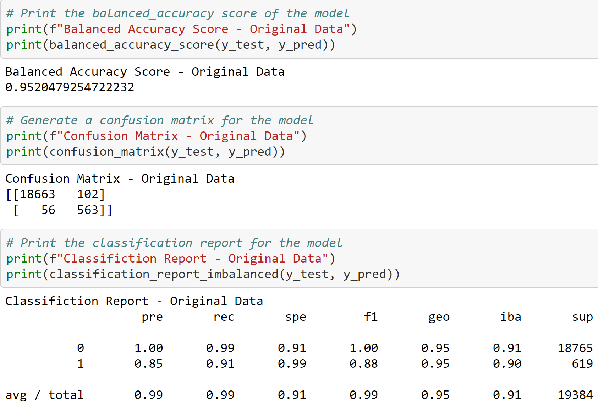
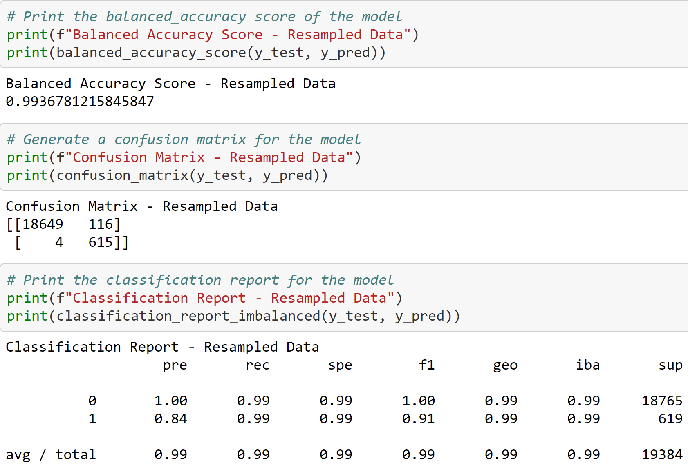

# Credit-Risk-Classification

A Python based approach, using logisitical regression models to be predict values of loan quality / status.

Analysis begins with extracting the loan_status variable from the dataframe and running instance of train_test_split

We create a logistic regression model, with a random state of 1 to ensure consistency with retesting of the data.

This LR model is then used to run a prediction using the X testing data to produce a y_pred value.

The y_pred value is then compared to the y_test data to serve as a comparison point between the model’s predictive abilities and the actual data.

Another logistic regression model is also created, but incorporates a random oversample model of the original testing data and resampled values for X and y.

Finally, we end on a comparison of the classification report data and, interpretting the results, we give our analysis of what modelis the "better" of the two.

---

## Technologies

This analysis runs on python version 3.7, with the following add-ons:

* [imbalanced-learn](https://imbalanced-learn.org/stable/#) - For creation of classification reports.

---

## Installation Guide

Before running the analysis, the following packages must be installed:

*    conda install -c conda-forge imbalanced-learn
*    conda install -c conda-forge pydotplus

---

## Example

For a visual reference as to how the analysis was performed, please refer to the below:

---

## Contributors

Santiago Rosas

