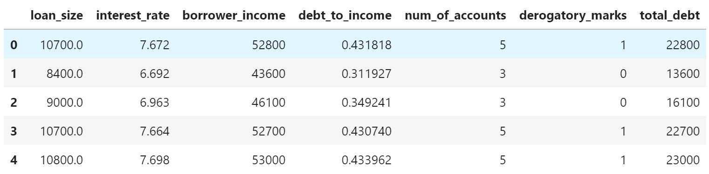
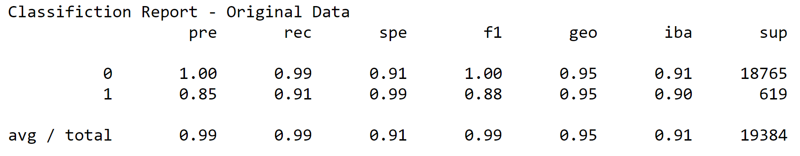
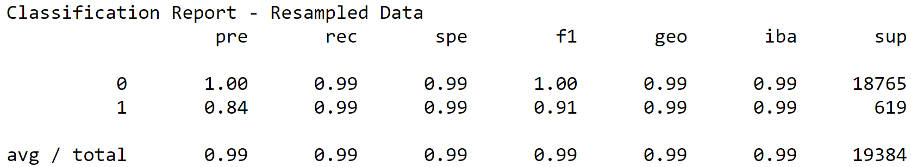

# Module 12 Report

## Overview of the Analysis

The purpose of this analysis is to determine which of the two developed logistic regression models are best suited for the purpose of identifying normal loans and default risk loans for the client company. 

Alternatively, both models may be rejected in the case that neither is determined to be satisfactory on the basis of their scoring.

The financial information is based upon a complied CSV listing of 77,536 loans, containing information such as loan size, interest rate, and debt to income ratio.

The information we are attempting to predict is the ability of the model(s) to correctly identify what are considered to be normal / healthy loans and those that are at the risk of default.

The variable we are attempting to predict is specifically “loan_status”, as it pertains to our client’s primary interest.

After extracting the loan_status variable from the dataframe, we perform a train_test_split to setup our data for testing purposes.

We create a logistic regression model, with a random state of 1 to ensure consistency with retesting of the data.

This LR model is then used to run a prediction using the X testing data to produce a y_pred value.

The y_pred value is then compared to the y_test data to serve as a comparison point between the model’s predictive abilities and the actual data.

Another logistic regression model is also created, but incorporates a random oversample model of the original testing data and resampled values for X and y.

## Results

Machine Learning Model 1 (Logistic Regression):

 

  * Accuracy – spe – true negative / (true negative + false positive)
    * Normal loans – 91 %
    * Default risk loans – 99 %
  
  * Precision – pre – true positive / (true positive + false positive)
    * Normal loans – 100 %
    * Default risk loans – 85 %
  
  * Recall – rec – true positive / (true positive + false negative)
    * Normal loans – 99 %
    * Default risk loans – 91 %

Machine Learning Model 2 (Logistic Regression & Random Oversampler):

 

  * Accuracy – spe – true negative / (true negative + false positive)
    * Normal loans – 99 %
    * Default risk loans – 99 %
  
  * Precision – pre – true positive / (true positive + false positive)
    * Normal loans – 100 %
    * Default risk loans – 84 %
  
  * Recall – rec – true positive / (true positive + false negative)
    * Normal loans – 99 %
    * Default risk loans – 99 %

## Summary

On the basis of the classification reports for the machine learning models, I believe the second model, which incorporates the random oversampler model, is the better of the two.

I base my judgement on the improved scoring in the Recall and Accuracy / Specificity statistics which can be interpreted as a lowering in the number of false positives (for Accuracy) and false negatives (for Recall).

Although Precision did decrease by 1 %, the increase in 8 % for Recall and Accuracy more than makes up for the difference.

The performance certainly is dependent on the problem we are attempting to solve as there is a greater emphasis to be placed upon the ability to accurately predict the default risk loans as they pose the greater business risk for the client than normal healthy loans.

Going back to the Results section, the value of Model 2 can be identified in the Recall section where there is an increase by  8 % in the ability to correctly identify risky loans for the business.
