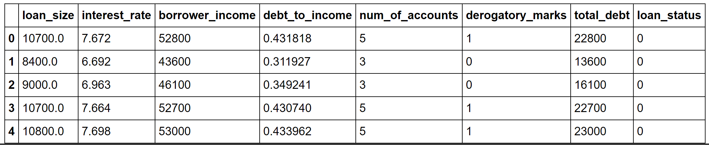

# Module 12 Report

## Overview of the Analysis

The purpose of this analysis is to determine which of the two developed logistic regression models are best suited for the purpose of identifying normal loans and default risk loans for the client company. 

Alternatively, both models could be rejected in the case that neither is determined to be satisfactory on the basis of their scoring.

The financial information is based upon a complied CSV listing of 77,536 loans, containing information such as loan size, interest rate, and debt to income ratio.

The information we are attempting to predict is the ability of the model(s) to correctly identify what are considered to be normal / healthy loans and those that are at the risk of default.

The variable we are attempting to predict is specifically “loan_status”, as it pertains to our client’s interest in primary interest.

After extracting the loan_status variable from the dataframe, we perform a train_test_split to setup our data for testing purposes.

We create a logistic regression model, with a random state of 1 to ensure consistency with retesting of the data.

This LR model is then used to run a prediction using the X testing data to produce a y_pred value.

The y_pred value is then compared to the y_test data to serve as a comparison point between the model’s predictive abilities and the actual data.

Another logistic regression model is also created, but incorporates a random oversample model of the original testing data and resampled values for X and y.

## Results

* Machine Learning Model 1 (Logistic Regression):

 

  * Accuracy – spe – true negative / (true negative + false positive)
    * Normal loans – 91 %
    * Default risk loans – 99 %
  
  * Precision – pre – true positive / (true positive + false positive)
    * Normal loans – 100 %
    * Default risk loans – 85 %
  
  * Recall – rec – true positive / (true positive + false negative)
    * Normal loans – 99 %
    * Default risk loans – 91 %

* Machine Learning Model 2 (Logistic Regression & Random Oversampler):

 

  * Accuracy – spe – true negative / (true negative + false positive)
    * Normal loans – 99 %
    * Default risk loans – 99 %
  
  * Precision – pre – true positive / (true positive + false positive)
    * Normal loans – 100 %
    * Default risk loans – 84 %
  
  * Recall – rec – true positive / (true positive + false negative)
    * Normal loans – 99 %
    * Default risk loans – 99 %

## Summary

Summarize the results of the machine learning models, and include a recommendation on the model to use, if any. For example:
* Which one seems to perform best? How do you know it performs best?
* Does performance depend on the problem we are trying to solve? (For example, is it more important to predict the `1`'s, or predict the `0`'s? )

If you do not recommend any of the models, please justify your reasoning.
